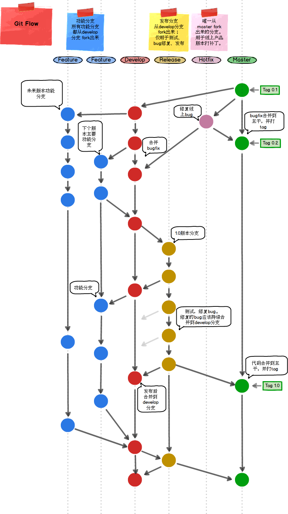

# 分支管理

::: tip 描述
分支管理及 `git` 工作流
:::

## 主要分支说明

- `master`： `protected`分支
- `develop`： 开发分支，开发人员将`feature`分支合并至此
- `feature`： 功能分支，开发人员新拉取`feature`分支进行新功能模块的开发，开发完成测试无误后合并至`develop`分支
- `release`： 用于版本发布
- `hotfix`： 热修复分支，从 `master` 拉取

**feature 命名**: feature-[账号名]-[功能模块]

如场景模块的功能开发， `feature-kezai-scenes`

## `Git Flow`

