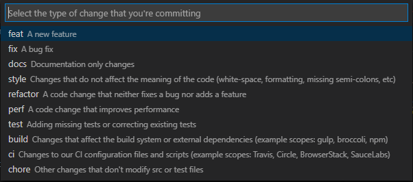

# 提交规范

::: tip 描述
统一定义管理代码提交规范，方便 持续集成发布 `tag`、 `release` 以及生成 `chagnelog` 文档，使用 `Angular commit` 规范标准，细节查看[`https://github.com/angular/angular/blob/master/CONTRIBUTING.md#-commit-message-guidelines`](https://github.com/angular/angular/blob/master/CONTRIBUTING.md#-commit-message-guidelines)
:::

## 基本格式

```text
<type>(<scope>): <subject>
<BLANK LINE>
<body>
<BLANK LINE>
<footer>
```

`Type` 类型：

- `feat`：新功能（`feature`）
- `fix`：修补 `bug`
- `docs`：修改文档（`documentation`）
- `style`：修改格式，如标签、空格、格式化、分号等（不影响代码运行的变动）
- `refactor`：重构（即不是新增功能，也不是修改 `bug` 的代码变动）
- `test`：增加测试
- `chore`：构建过程或辅助工具的变动

通常 `feat` 和 `fix` 会被放入 `changelog` 中，其他(`docs`、`chore`、`style`、`refactor`、`test` )通常不会放入 `changelog` 中。

## 提交范例

> 尽可能详细描述提交的内容

```text
feat: create a new feature

fix: 修复登录页在IE10浏览器布局错乱的问题

fix: add vuepress-plugin-export-pdf in config.js

docs: generate manual docs

```

## 其他

可以安装 `vscode-commitizen` 插件，使用 `ctrl+shift+p` 或 `command+shift+p` 使用 `conventional commit` 提交代码。

`optional` 的选项可以忽略输入。


