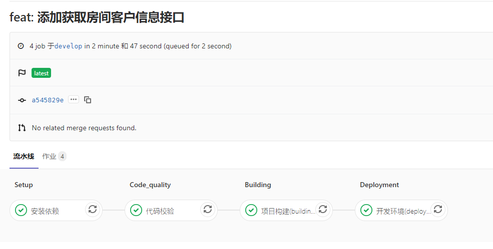

# 部署说明

::: tip 描述
基于目前的项目分支结构 [分支管理](./1-branch.md)，对工程进行持续集成、持续部署配置管理。因没有独立的开发环境服务器，故部署设定为测试环境及生产环境。
:::

## Web 应用部署

### 工作流

- 开发人员在其功能分支（`feature-*`）进行功能开发及测试，代码提交后，将触发 `CI` 对该分支代码质量进行检测
- 自测完成后，开发人员将其 `feature` 分支合并至 `develop` 分支，将触发 `CI` 测试环境部署管道，自动构建部署至 `iot` 服务
- 测试人员测试完毕后，开发人员将 `develop` 分支合并至 `release` 分支，触发生产环境管理，执行自动构建项目，部署至 `cloud` 服务时，需要负责人手动触发部署按钮。
- 合并结束后，将自动生成 `tag` 及 发布 `release` 包

## 小程序应用部署

::: tip 描述
小程序部署分为 体验版、灰度发布、全量发布。发布仅将代码上传至小程序服务平台，最终上线需负责任手动发布上线。
其中， `*-alpha` 为 体验版本， `*-beta` 为灰度发布版本，类 `v1.0.0` 为全量发布版本。
:::

### 原生小程序

- 开发人员将其 `feature` 分支合并至 `develop` 分支，将触发 `CI` 管道，自动发布云函数及上传体验版代码，并生成预览二维码
- 测试结束后，如果是灰度发布版本，将 `develop` 分支合并至 `release` 分支，将自动发布云函数及上传，如果是全量版本，合并至 `master` 分支。
- 合并结束后，将自动生成 `tag` 及 发布 `release` 包
- 负责人登录小小程序开发者平台，进行对应版本的发布操作

### 工程化小程序

- 开发人员将其 `feature` 分支合并至 `develop` 分支，将触发 `CI` 管道，对项目进行构建及上传代码，并生成预览二维码
- 测试结束后，如果是灰度发布版本，将 `develop` 分支合并至 `release` 分支，将自动构建及上传，如果是全量版本，合并至 `master` 分支。
- 合并结束后，将自动生成 `tag` 及 发布 `release` 包
- 负责人登录小小程序开发者平台，进行对应版本的发布操作

