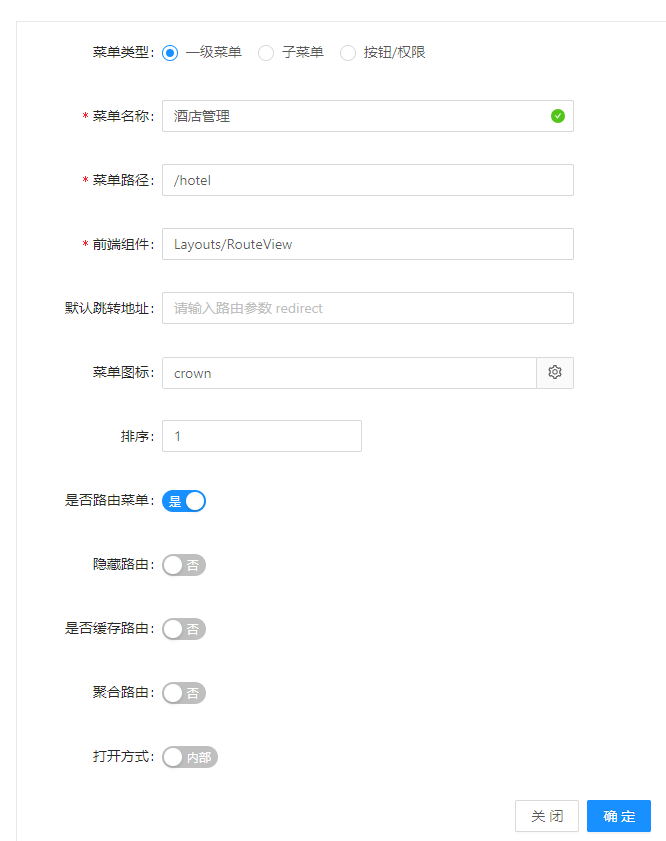
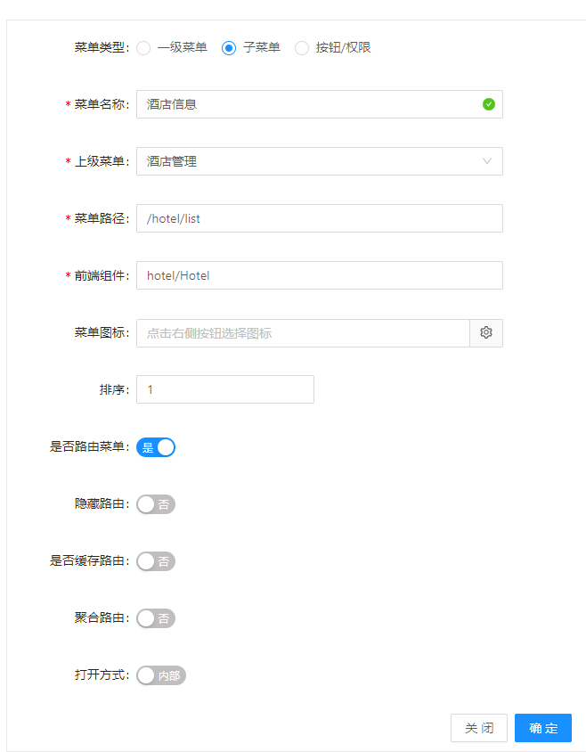
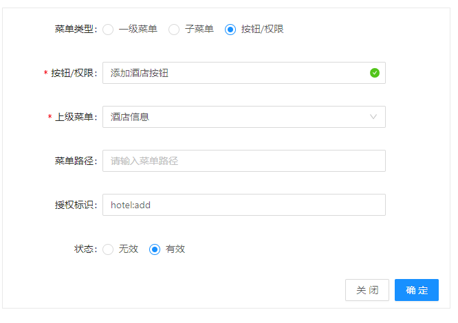

# 管理平台

::: tip 描述
[`admin-pro`](http://git.on-bright.com:8081/iweb/admin-pro) 是基于 [`ant design of vue`](https://www.antdv.com/docs/vue/introduce-cn/) 及昂宝后台服务整合的基础管理平台。包含登录、登出、用户管理、角色管理、系统消息、菜单管理、消息推送等基础模块。后续的管理平台系统均以 `admin-pro` 作为蓝本进行开发和拓展。
:::

## 开发

### 安装依赖

```js
npm install
```

### 修改代理服务

打开 `vue.config.js`，修改代理配置：

```javascript

 devServer: {
    port: 8000,
    proxy: {
      '/pro': {
        target: 'https://aliiot.on-bright.com/control',
        ws: false,
        changeOrigin: true,
        pathRewrite: {
          '/pro': '' // 默认所有请求都加了/pro前缀，需要去掉
        }
      }
    }
  },
```

将 `target` 修改为对应的接口服务路径。注意：此处的 `/pro` 与 `config/env.config.js` 中的 `DEV_BASE_API ` 对应。

如果还没有提供接口服务，可以启动 `mock` 数据服务。打开 `main.js` 文件，启动模拟数据服务 [`mock`](#mock)。

```javascript
// mock
// WARNING: `mockjs` NOT SUPPORT `IE` PLEASE DO NOT USE IN `production` ENV.
import './mock'
```

### 启动服务

```javascript
npm run serve
```

## 项目结构

```tree
│  .browserslistrc
│  .editorconfig
│  .eslintrc.js
│  .gitattributes
│  .gitignore
│  .prettierrc
│  babel.config.js
│  jest.config.js
│  jsconfig.json
│  package-lock.json
│  package.json
│  postcss.config.js
│  README.md
│  vue.config.js
│  
├─public
│      
├─src
│  │  App.vue
│  │  main.js
│  │  
│  ├─api  // 接口
│  │      
│  ├─assets // 静态资源
│  │          
│  ├─components // 系统共享组件
│  │          
│  ├─config // 系统配置文件
│  │      
│  ├─core // 核心配置
│  │              
│  ├─layouts // 系统布局
│  │      
│  ├─locales // 本地化文件
│  │          
│  ├─mock // 模拟数据服务
│  │          
│  ├─router // 路由
│  │      
│  ├─store // 状态管理
│  │          
│  ├─utils // 工具集
│  │  │  
│  │  ├─ajax // ajax 工具
│  │  │      
│  │  └─mixins // vue mixins
│  │          
│  └─views // 系统页面视图
```

### 接口定义

按功能模块定义 `api` 文件。

```text
├─src
│  │  
│  ├─api
│  │      agent.js
│  │      login.js
│  │      system.js
```

如 `login.js` 接口文件：

```javascript
import { postAction } from '@/utils/ajax'

// 授权登录模块
const login = (username, password) => postAction('/auth/login', { username, password })
const logout = (token) => postAction('/auth/logout', {}, { headers: { 'X-Access-Token': token } })

export {
  login,
  logout
}

```

代码调用示例：

```javascript
import { login, logout } from '@/api/login'

...
Login ({ commit }, user) {
  return new Promise((resolve, reject) => {
    login(user.username, user.password).then(response => {
      if (isAjaxSuccess(response.code)) {
        ...
      }
      resolve(response)
    }).catch(error => {
      reject(error)
    })
  })
}

```

### 静态资源

`assets` 目录存放图标、公用样式、图片资源。

```text
├─src
│  │  
│  ├─assets
│  │  │  
│  │  ├─icons
│  │  │      
│  │  ├─images
│  │  │      
│  │  └─styles
```

### 系统配置

```text
├─src
│  │  
│  ├─config
│  │      defaultSettings.js
│  │      env.config.js
│  │      router.config.js
```

- `defaultSettings.js`：对系统全局进行配置
- `env.config.js`：系统环境配置
- `router.config.js`：系统路由配置

#### `defaultSetting` 系统配置

```javascript
/**
 * 项目默认配置项
 * primaryColor - 默认主题色, 如果修改颜色不生效，请清理 localStorage
 * navTheme - sidebar theme ['dark', 'light'] 两种主题
 * colorWeak - 色盲模式
 * layout - 整体布局方式 ['sidemenu', 'topmenu'] 两种布局
 * fixedHeader - 固定 Header : boolean
 * fixSiderbar - 固定左侧菜单栏 ： boolean
 * contentWidth - 内容区布局： 流式 |  固定
 *
 * multiTab - 标签导航 : boolean
 * fixedMultiTab - 固定标签导航 : boolean
 * title - 系统标题，登录页标题及系统头部标题
 * logo - 系统logo：登录页、导航
 */

export default {
  navTheme: 'dark', // theme for nav menu
  primaryColor: '#1890ff', // primary color of ant design
  layout: 'sidemenu', // nav menu position: `sidemenu` or `topmenu`
  contentWidth: 'Fluid', // layout of content: `Fluid` or `Fixed`, only works when layout is topmenu
  fixedHeader: true, // sticky header
  fixSiderbar: true, // sticky siderbar
  colorWeak: false,
  multiTab: false,
  fixedMultiTab: false,
  menu: {
    locale: true
  },
  title: '昂宝后台管理系统',
  logo: 'logo.svg',
  pwa: false,
  iconfontUrl: '',
  production: process.env.NODE_ENV === 'production' && process.env.VUE_APP_PREVIEW !== 'true',
  pageOption: {
    loginMode: 'simple'
  }
}

```

#### `env.config.js` 环境配置

```javascript

// 开发环境接口服务基路径
const DEV_BASE_API = './pro'
// 测试环境接口服务基路径
const TEST_BASE_API = ''
// 生产环境接口服务基路径
const PRO_BASE_API = '/control'
const envConfig = {
  dev: {
    baseApi: DEV_BASE_API
  },
  test: {
    baseApi: TEST_BASE_API
  },
  prod: {
    baseApi: PRO_BASE_API
  }
}

// WebSocket 链接， {topic} 为订阅主题 
// export const WEBSOCKET_URL = 'https://aliiot.on-bright.com/pro/websocket/{topic}'
// export const WEBSOCKET_URL = 'https://aliiot.on-bright.com/nurseTest/websocket/{topic}'
export const WEBSOCKET_URL = '/control/websocket/{topic}'

export function isProEnv () {
  return process.env.NODE_ENV === 'production'
}

export function isTestEnv () {
  return process.env.NODE_ENV === 'test'
}

export function isDevelopEnv () {
  return process.env.NODE_ENV === 'development'
}

// 接口请求基路径
export function getReqBaseUrl () {
  return isProEnv() ? envConfig.prod.baseApi : envConfig.dev.baseApi
}

// @TODO router.base
export const ROUTER_BASE = isProEnv() ? 'hcp' : '/'

export default envConfig

```

### 网络请求

```text
├─src
│  ├─utils // 工具集
│  │  ├─ajax
│  │  │      action.js
│  │  │      axios.js
│  │  │      index.js
│  │  │      request.js
```

定义几个常用请求方法。`getAction`、`postAction`、`putAction`、`deleteAction`、`downloadAction `、`downloadActionByWin`、`getRequestUrl`，其中 `downloadAction ` 为下载 `blob` 数据文件的文件 , `getRequestUrl` 为获取当前请求路径，主要用于下载或文件绝对路径。

调用示例：

```js
const { getAction, postAction, putAction, deleteAction, getRequestUrl } from '@/utils/ajax'
```

### 组件

组件以大驼峰命名法进行命名，如：`PageLoading`

- `Bizz`： 为系统公用业务组件
- `IOT`： 为设备相关组件，后续抽离

## 路由/菜单说明

### 格式和说明

```javascript
const routerObject = {
  redirect: noredirect,
  name: 'router-name',
  path: '/',
  hidden: true,
  component: '',
  meta: {
    title: 'title',
    icon: 'a-icon',
    target: '_blank|_self|_top|_parent',
    keepAlive: true,
    hiddenHeaderContent: true
  }
}
```

`{ Route }` 对象

| 参数     | 说明                                      | 类型    | 默认值 |
| -------- | ----------------------------------------- | ------- | ------ |
| hidden   | 控制路由是否显示在 sidebar                | boolean | false |
| redirect | 重定向地址, 访问这个路由时,自定进行重定向 | string  | -      |
| name     | 路由名称, 必须设置,且不能重名           | string  | -      |
| component| 组件路径, 必须设置,且不能重名           | string  | -      |
| path | 访问路径, 必须设置,且不能重名           | string  | -      |
| meta     | 路由元信息（路由附带扩展信息）            | object  | {}     |
| hideChildrenInMenu | 强制菜单显示为Item而不是SubItem(配合 meta.hidden) | boolean  | -   |

`{ Meta }` 路由元信息对象

| 参数                | 说明                                                         | 类型    | 默认值 |
| ------------------- | ------------------------------------------------------------ | ------- | ------ |
| title               | 路由标题, 用于显示面包屑, 页面标题 *推荐设置                 | string  | -      |
| icon                | 路由在 menu 上显示的图标                                     | [string,svg]  | -      |
| keepAlive           | 缓存该路由                                                   | boolean | false  |
| target              | 菜单链接跳转目标（参考 html a 标记）                          | string | -  |

### 路由例子

```javascript
const asyncRouterMap = [
  {
    path: '/',
    name: 'index',
    component: BasicLayout,
    meta: { title: '首页' },
    redirect: '/dashboard/analysis',
    children: [
      {
        path: '/dashboard',
        component: RouteView,
        name: 'dashboard',
        redirect: '/dashboard/workplace',
        meta: {title: '仪表盘', icon: 'dashboard'},
        children: [
          {
            path: '/dashboard/analysis',
            name: 'Analysis',
            component: () => import('@/views/dashboard/Analysis'),
            meta: {title: '分析页'}
          }
        ]
      },

      // result
      {
        path: '/result',
        name: 'result',
        component: PageView,
        redirect: '/result/success',
        meta: { title: '结果页', icon: 'check-circle-o' },
        children: [
          {
            path: '/result/success',
            name: 'ResultSuccess',
            component: () => import(/* webpackChunkName: "result" */ '@/views/result/Success'),
            meta: { title: '成功' }
          },
          {
            path: '/result/fail',
            name: 'ResultFail',
            component: () => import(/* webpackChunkName: "result" */ '@/views/result/Error'),
            meta: { title: '失败' }
          }
        ]
      },
      ...
    ]
  },
]
```

### 系统上创建菜单

系统分一级菜单、二级菜单及按钮权限菜单

一级菜单配置示例：



二级菜单配置示例：



按钮权限菜单配置：



### 权限控制说明

```text
getUserPermission 获取用户菜单及按钮权限
        -->  解析渲染菜单并生成路由
        -->  渲染页面，检测按钮权限(v-isPermitted="user:add")
```

## mock

对接口进行代理转发，获取接口模拟数据。

```text
├─mock
│  │  index.js
│  │  tree.txt
│  │  util.js
│  │  
│  └─services
│          article.js
│          auth.js
│          manage.js
│          other.js
│          system.js
│          tagCloud.js
│          user.js
```

具体定义查阅 `mock/services/` 下的文件，最后在 `index.js` 中引用。

## 消息推送

消息推送结合 `NoticeIcon` 消息提示使用，打开 `src/components/NoticeIcon` 文件， 引入 `websocket.js`：

```javascript
import { WebSocketMixin } from '@/utils/websocket'

export default {
  name: 'NoticeIcon',
  mixins: [ WebSocketMixin ],
  mounted () {
    this.initWebSocket(this.$store.getters.userInfo.id)
    this.websocket.onmessage = this.onWebSocketMessage
  },
  methods: {
    onWebSocketMessage (e) {
      const data = eval(`(${e.data})`)
      if (data.cmd !== 'heartcheck') {
      }
      //心跳重置检测
      // this.startHeartBeat()
    }
  },
  destroyed () {
    this.closeWebSocket()
  }
}
```

需要取消使用 `NoticeIcon` 时，在 `src/components/GlobalHeader/RightContent` 中注释掉相关引入即可。

## 订阅广播设备推送

同 [消息推送](#消息推送)，订阅广播也在 `NoticeIcon` 中使用：

```javascript
import { WebSocketMixin } from '@/utils/websocket'
import { BroadcastMixin } from '@/utils/broadcast'
export default {
  name: 'NoticeIcon',
  mixins: [ WebSocketMixin, BroadcastMixin ],
  mounted () {
    this.initWebSocket(this.$store.getters.userInfo.id)
    this.websocket.onmessage = this.onWebSocketMessage
  },
  methods: {
    onWebSocketMessage (e) {
      const data = eval(`(${e.data})`)
      if (data.cmd !== 'heartcheck') {
      }
      //心跳重置检测
      // this.startHeartBeat()
      // 广播 websocket 事件
      this.broadcast(data)
    },
  },
  destroyed () {
    this.closeWebSocket()
  }
}
```

`broadcast` 中的定义：

```js
// websocket 消息cmd对应事件
export const SocketMessageCmdEvent = {
  'a001': 'obox',
  'a100': 'state',
  '2003': 'scan',
  'a015': ''
}

// 推送类型
export const SocketMessageTypeEvent = {
  '0': 'obox-data',
  '2': 'obox-state',
  '4': 'infrared-state',
  '5': 'infrared-data',
  '6': 'obox-connected',
  '7': 'obox-connected-fail'
}

export const BroadcastMixin = {
  methods: {
    broadcast (data) {
      if (data.type === 0 && SocketMessageCmdEvent[data.cmd]) {
        this.$bus.$emit(SocketMessageCmdEvent[data.cmd], data)
      } else if ([2, 6, 7].includes(data.type) && SocketMessageTypeEvent[data.type]) {
        this.$bus.$emit(SocketMessageTypeEvent[data.type], data)
      }
    }
  }
}

```
