# SourceTree基本使用教程

## 0. 安装

> 下载`SourceTreeSetup`安装包文件

安装步骤：
 - 注册账号

## 1. 配置`ssh`密钥信息

在菜单栏中【工具】—【选项】中配置已生成的 `SSH` 密钥（选择`SSH`客户端为`OpenSSH`）

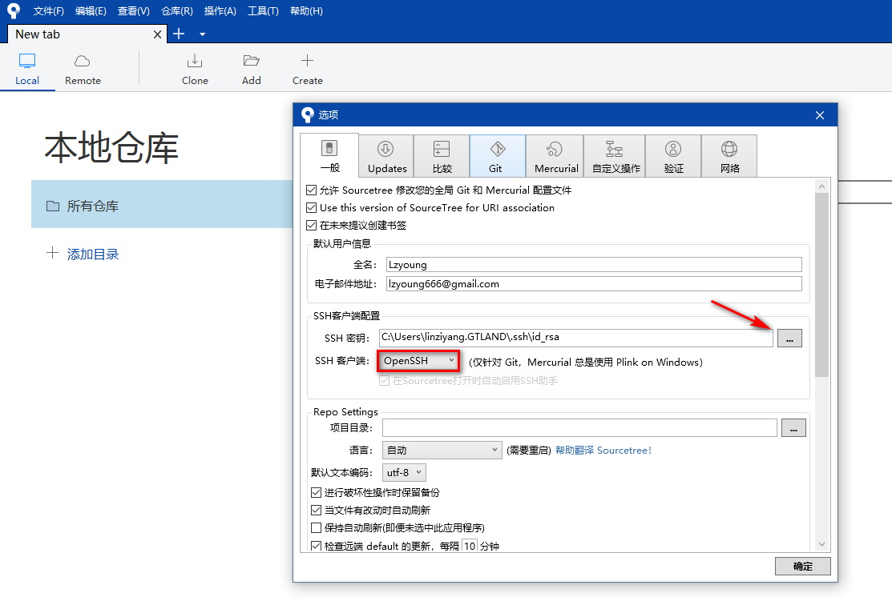

## 2. `Clone`远程仓库至本地

2.1 到`GitLab`中选取需要`clone`的项目，复制链接地址

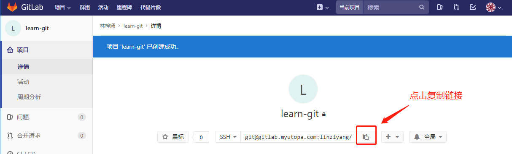

2.2 在`SourceTree`中点击【`Clone`】，填写相应信息，依次为：

- 远端仓库地址
- 本地保存仓库地址
- 本地仓库名称

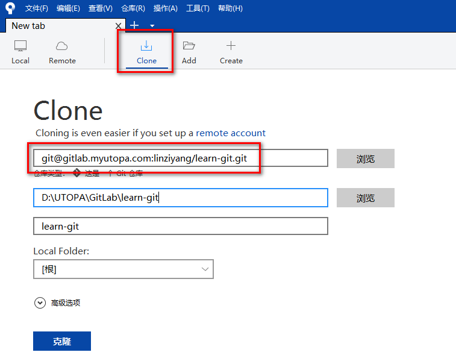

2.3 填写完成后，点击【克隆】按钮，进行clone，完成后如下图：

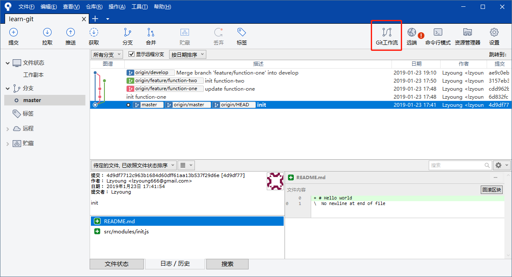

## 3. 工作流

3.1 点击【`Git`工作流】，弹出框中点击【确定】（默认设置）

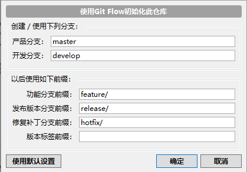

3.2 在左侧分支树中新增了`develop`分支且项目被默认切换到`develop`分支下

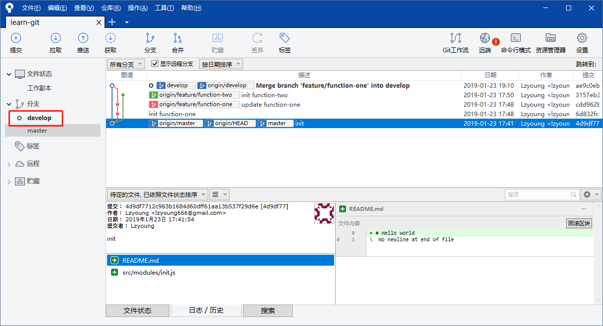

## 4. 新建`feature`分支

4.1 若分支中有需要继续开发的功能，双击该`feature`检出该功能`feature`分支

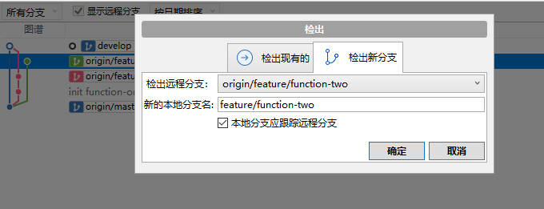

4.2 在左侧分支树中新增了`feature`分支且项目被默认切换到继续开发的`feature`分支下

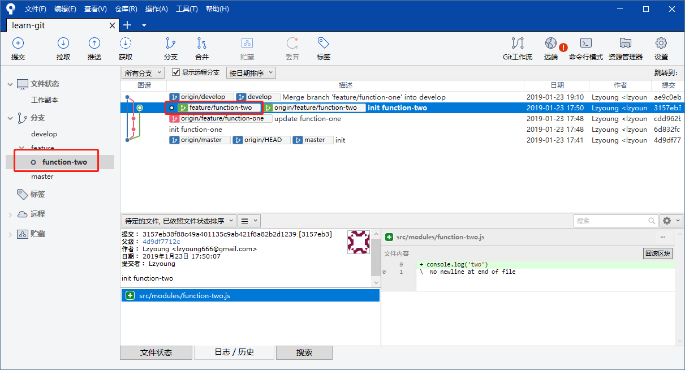

4.3 若要新建功能分支，需要双击左侧分支树中的`develop`切换至该分支，点击【`Git`工作流】

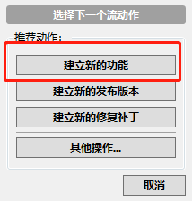

4.4 填写新增功能分支名称，点击【确定】新建功能分支

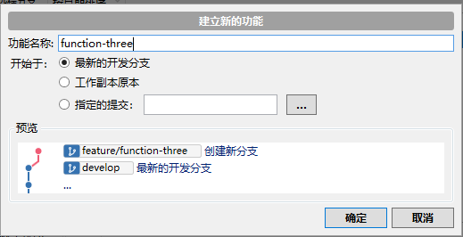

## 5. `git add `

5.1 `SourceTree`会自动将分支切换到新建的分支。在当前分支中新增内容

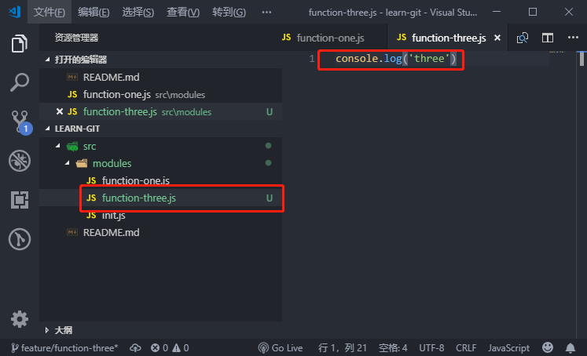

5.2 点击【提交】进入提交页面，将要提交的文件拖动至暂存区（或右键需要提交的文件点击【添加】）进行`add`操作

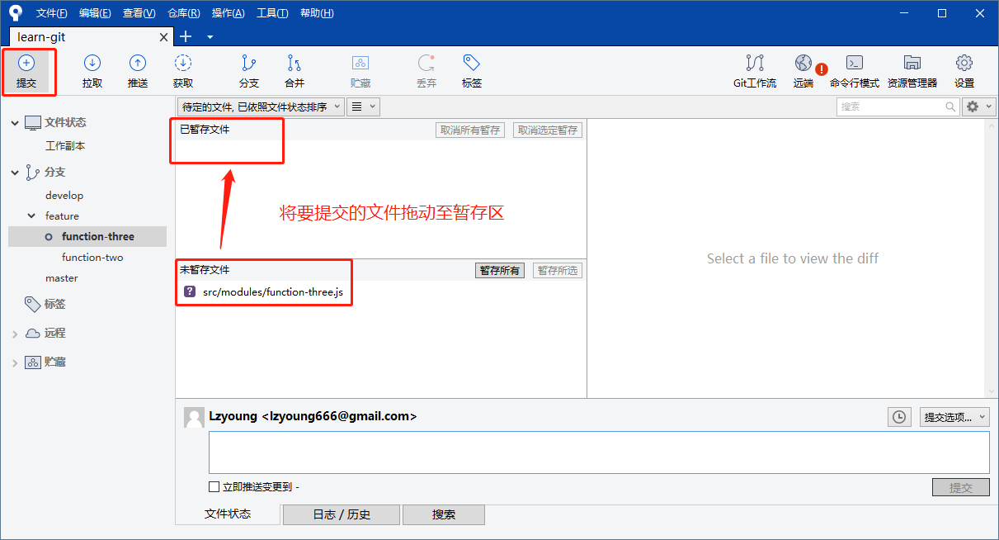

## 6. `git commit`

确认需提交的文件后，填写提交信息，点击【提交】进行`commit`操作

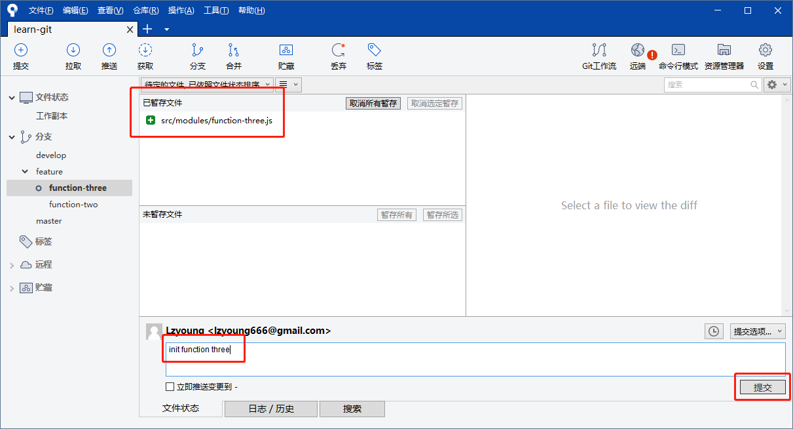

## 7. `git merge`

合并已完成功能分支至`develop`分支，需先切换至`develop`分支，右键需要合并至`develop`分支的`feature`分支，选择【合并...至当前分支】

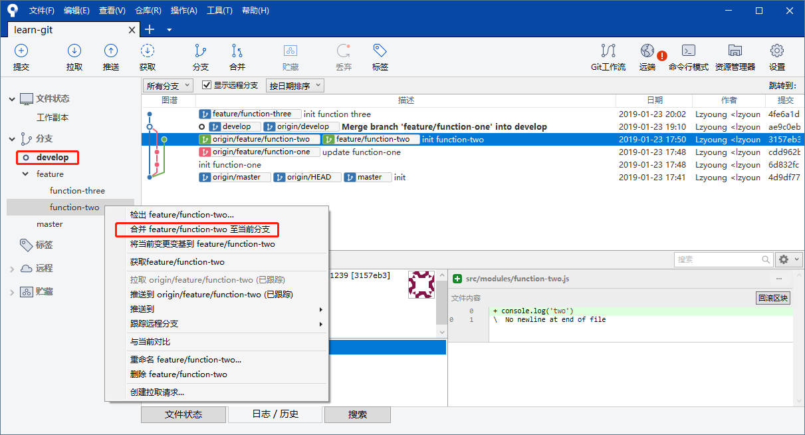

## 8. `git push`

8.1 将`develop`分支推送至远程仓库，点击【推送】进行`push`操作

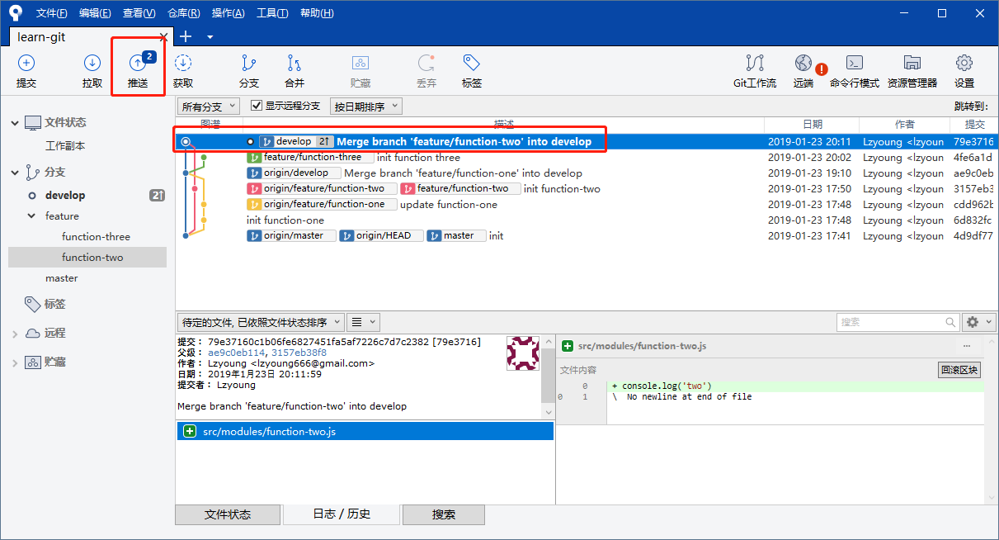

8.2 选择要推送至远程仓库的分支，点击【推送】完成`push`操作

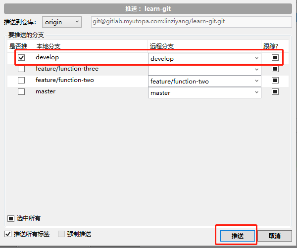

## 9. `git pull`

拉取远程仓库中的分支（每次提交都需要确保已经拉取远程`develop`代码）

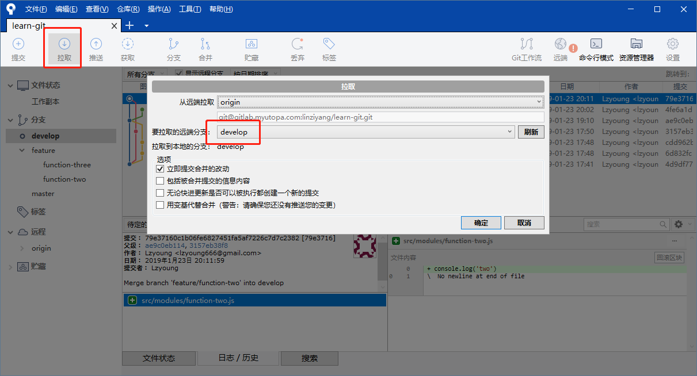